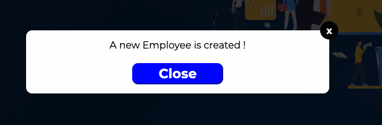

# gr-react-modal

## Modal window pluggin for project 14 : 

A simple react modal

1. [Installation](#Installation)
2. [Examples of use](#Example)
3. [Default option](#Default)

<div id='Installation'>

## Installation

You can install gr-react-modal with npm:
`npm i gr-react-modal`

For import rs-react-modal:
`import {Modal} from "gr-react-modal"`

<div id='Example'>

## Examples of use

### Example 1: by default

```js
<Modal
    close = {close}
    open = {active}
/>
```


### Example 2: with close button only (showClose = true)

```js
const customButton = {
    display: "none"
}

<Modal
    close = {close}
    escape = {false}
    open = {active}
    outside = {false}
    showClose = {true}
    styleButton = {customButton}
/>
```

 

### Example 3: customized

```js
const customContent = {
    background: "#594B94",
    color: "#FFF",
    borderRadius: "0"
}

const customButton = {
    fontSize: "1rem",
    cursor: "pointer",
    fontWeight: "bold",
    background: "#F04329",
    borderColor: "#F04329",
    width: "12rem",
    padding: "1rem",
    borderRadius: ".3rem"
}

<Modal
    buttonContent = "Example button"
    close = {close}
    modalContent = "Example 3"
    open = {active}
    styleButton = {customButton}
    styleContent = {customContent}
/>
```

 

<div id='Default'>

## Default option

### Default content

```js
Modal.defaultProps = {
  buttonContent: "Close", // To customize the button content
  escape: true, // To close the modal by pressing `ESC`
  fadeDelay: null, // Point during the overlay's fade-in that the modal begins to fade in (number between 0 and 1)
  fadeDuration: null, // Number of milliseconds the fade transition takes (null means no transition)
  modalContent: "React modal is open!", // To customize the modal content
  open: false, // To open the modal
  outside: true, // To close the modal by clicking the overlay
  showClose: false, // To activate button x
  styleButton: {}, // To customize button style
  styleButtonX: {}, // To customize button x style
  styleContainer: {}, // To customize overlay style
  styleContent: {} // To customize modal content style
}
```

### Default type

```js
Modal.propTypes = {
  buttonContent: PropTypes.string,
  close: PropTypes.func.isRequired, // REQUIRED - Action when closing
  escape: PropTypes.bool,
  fadeDelay: PropTypes.number,
  fadeDuration: PropTypes.number,
  modalContent: PropTypes.string,
  open: PropTypes.bool.isRequired, // REQUIRED - TRUE to open the modal
  outside: PropTypes.bool,
  showClose: PropTypes.bool,
  styleButton: PropTypes.object,
  styleButtonX: PropTypes.object,
  styleContainer: PropTypes.object,
  styleContent: PropTypes.object
}
```